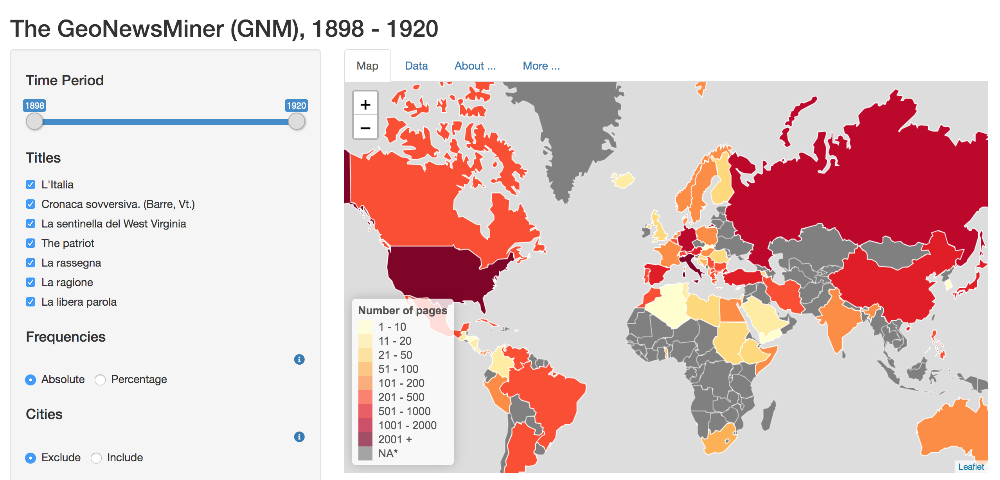

# The GeoNewsMiner (GNM): An interactive spatial humanities tool to visualize geographical references in historical newspapers

[](https://doi.org/10.5281/zenodo.3484591)

The GeoNewsMiner (GNM) is an interactive tool that maps and visualises geographical references in historical newspapers. As a use case, we used Italian immigrant newspapers published in the United States from 1898 to 1920, as collected in the corpus [*ChroniclItaly*](https://public.yoda.uu.nl/i-lab/UU01/T4YMOW.html) (Viola 2018). The corpus was previously tagged for entities using a sequence tagging tool ([Riedl and Padó 2018](https://www.aclweb.org/anthology/P18-2020.pdf)). This tagged version of *ChroniclItaly* is [*ChroniclItaly 2.0*](https://public.yoda.uu.nl/i-lab/UU01/4MECRO.html) and it is available as an open access resource. The overarching goal of this project is to offer new perspectives on the geographies of the past. Methodologically, we extracted from the corpus the geographical references, quantified them, geocoded them, and plotted them on a map. As a visualization tool, we developed the GNM App using a [Shiny app](https://shiny.rstudio.com/). This allowed us to present and analyse the results in an intuitive, interactive, and reproduceable way. This documentation is the step-by-step description of the project.

GNM is available as an open access app. Click [here](https://utrecht-university.shinyapps.io/GeoNewsMiner/) to use the GNM App.

[](https://utrecht-university.shinyapps.io/GeoNewsMiner/)

## Table of contents

1. [Spatial Humanities](#spatial-humanities)
2. [*ChroniclItaly*](#chroniclitaly)
3. [Sequence Tagging](#sequence-tagging)
4. [Geocoding with Google API](#geocoding-with-google-api)
5. [Installation](#installation)
6. [Shiny app](#shiny-app)
7. [Remarks](#remarks)
8. [License](#license)
9. [Links](#links)
10. [References](#references)
11. [The team](#the-team)
12. [How to cite GNM](#how-to-cite-gnm)

## Spatial Humanities
GNM has been created as an exploratory tool to assist researchers working in **spatial humanities**, a recently emerged interdisciplinary field -especially within the digital humanities -focused on geographic and conceptual space, particularly from a historical perspective. Essentially, spatial humanities are based on Geographic Information Systems (GIS). GIS are used to georeference a dataset, map it, display it, and analyse it by cross-referencing different layers of information. Such process of cross-referencing has provided researchers working in fields such as environmental history, historical demography, and economic, urban and medieval history with new perspectives leading them to challenge traditional positions and even explore new questions.
Drawing from the application of GIS and data mining, GNM aims to illustrate how the visualization of ethnic newspapers' place names can provide researchers with new perspectives on the geographies of the past so as to open up new ways to study migration history.

## *ChroniclItaly*
GNM is based on [*ChroniclItaly*](https://public.yoda.uu.nl/i-lab/UU01/T4YMOW.html) (Viola 2018), a corpus of Italian language newspapers published in the United States between 1898 and 1920. The corpus includes the digitized pages of seven Italian language newspapers published in California, Massachusetts, Pennsylvania, Vermont, and West Virginia. The collection includes the following titles: *L’Italia*, *Cronaca sovversiva*, *La libera parola*, *The patriot*, *La ragione*, *La rassegna*, and *La sentinella del West Virginia*. *ChroniclItaly*, which totals 4,810 issues and contains 16,624,571 words, gathers the front pages of each issue and it was collected from [*Chronicling America*](https://chroniclingamerica.loc.gov/newspapers/), an Internet-based, searchable database of U.S. newspapers published in the United States from 1789 to 1963 made available by the Library of Congress. *ChroniclItaly* is available as an open access resource.

## Sequence Tagging
*ChroniclItaly* was first tagged for entities using a [sequence tagging tool](https://github.com/riedlma/sequence_tagging#download-models-and-embeddings) (Riedl and Padó 2018) that implements [Tensorflow](https://www.tensorflow.org/). The Italian language model of the sequence tagging tool was trained on [I-CAB](http://ontotext.fbk.eu/icab.html) (Italian Content Annotation Bank), an open access corpus annotated for entities (i.e. persons, organizations, locations, and geopolitical entities), temporal expressions, and relations between entities. I-CAB contains 525 news articles taken from the newspaper *L'Adige* and totals up around 180,000 words.
Once the training was complete, the output had the following format:

```sh
il      il      KNOWN   O       O
principio      principio      KNOWN   O       O
delle   delle   KNOWN   O       O
ostilità       ostilità       KNOWN   O       O
fra     fra     KNOWN   O       O
la      la      KNOWN   O       O
Spagna  spagna  KNOWN   O       B-GPE
e       e       KNOWN   O       O
gli     gli     KNOWN   O       O
Stati   stati   KNOWN   O       B-GPE
Uniti   uniti   KNOWN   O       I-GPE
.       .       KNOWN   O       O
```

The first column is the input word, the second column specifies the pre-processed, lowercased word, the third column contains a flag, that is whether the word has been known during training (KNOWN) or not (UNKNOWN). If labels are assigned to the input file, these will appear in the third column. The last column contains the predicted tags. The no-entity tag is O. Because some entities (e.g., Stati Uniti "United States") have multiple words, the tagging scheme distinguishes between the beginning (tag B-...) or the inside of an entity (tag I-...). The tags are:

```sh
LOC -> Location
GPE -> Geo-political entity
PER -> Person
ORG -> Organization
```

The sequence tagging retrieved 1369 unique locations which had been referred to 214110 times throughout the whole corpus. Because each individual document is time stamped, the number of references to each location was quantified at any given time within the timeframe of *ChroniclItaly* (1898-1920). Afterwards, locations were geocoded by using the Google API.  

## Geocoding with Google API

In order to perform geocoding, users must have an API key. The API key is a unique identifier, a 40-character long string that is used to authenticate requests associated with a project. To get an API key, visit the [Google Cloud Platform Console](https://cloud.google.com/console/google/maps-apis/overview). 

Geocoding with Google is a two-stage process which requires [Google Geocoding API](https://developers.google.com/maps/documentation/geocoding/start). First, Google Geocoding API provides users with a Place ID for each location. The Place ID uniquely identifies a place as it is stored in the Google Places database and on Google Maps. Because the language of the dataset is Italian, the language of the API was set to Italian. It was found that setting the API language as the language of the data-set improves the accuracy of the geocoding results. At the same time, however, the results are also returned in Italian. In order to have the results returned in Enlgish, only the Place ID was extracted in this first stage. Once the Place ID was received, it was possible to use the Google Geocoding API to perform *reverse geocoding*, that is to obtain all the details for the location in English (e.g., geo-coordinates, administrative level). In this way, the results are dispalyed in English thus making the GNM App more user-friendly. 

The geocoding process was performed only for locations that occurred 8 times or more in the entire corpus. This methodological decision was made to overcome two limitations: 1) noise in the original data mainly due to OCR mistakes and 2) a relatively high number of false positives found by the sequence tagging tool <8 'locations'. Please refer to [/REMARKS.md](/REMARKS.md) for further details on the accuracy of the sequence tagger for Italian models.

## Understanding the Google Geocoding results
In addition to the geo-coordinates, Google also provides additional details, such as the tag *type[]* which indicates why Google has provided certain geo-coordinates to a location. Some of these geo-coordinates may have been "misinterpreted", therefore understanding the *type[]* of a location is important. "Misinterpretations" may happen especially when working with historical data. Because the Google Places database stores places based on a contemporary world map, the locations in a historical dataset may have changed name or may no longer exist. Moreover, categories such as country, city, region, municipality, etc. which Google uses to determine the location *type[]* are highly dependent on the location itself and consequently, certain categories may not apply or they may change from place to place.

For example, within the level *country*, Google distinguishes between five sub-levels: `administrative_area_level_1`, `administrative_area_level_2`, `administrative_area_level_3`, and so on. Generally speaking, the levels proceed from bigger (level 1) to  smaller (level 5). The type `locality` corresponds to a city or town. In the United States, for instance, level_1 would correspond to a State, level_2 to a county and so on. However, not every country would have States, counties, etc. In geocoding the places in *ChroniclItaly 2.0*, we encountered cases in which the level given by Google required a manual edit. Specifically, three main types of manual edits needed to be performed:
#### - Changing the level to a higher level:
This was the case of cities like Naples which Google tagged as `administrative_area_level_2` (municipality) instead of `locality`;
#### - Aggregating locations according to a higher level:
This was the case of places like *S. Pietro* -the square in Vatican City -or *New York Harbor*. In these cases, we manually changed the type (`establishment`) to match that of the corresponding country or city (`locality`);
#### - Changing a wrong *type[]*:
This was the case of places that no longer exist or that have changed name. An example of this kind is the city of *Zara* in Croatia which today is called Zadar and which was a province of the Kingdom of Italy from 1918 to 1947. However, Google tagged Zara as `establishment` and gave it the geo-coordinates of a Zara department store in the United States.

All the locations that have been manually edited are marked in red in the file `data/output_20191622_041444_geocoding_edit.xlsx`. This file can be compared with the file `output/output_20191622_041444_geocoding.xlsx` to see the original output. For more information on manually editing the locations, please refer to the section *Fixing geocoding errors* in the [notebook](https://github.com/lorellav/GeoNewsMiner/blob/master/ChroniclItaly.ipynb). For an overview of all the possible *types[]* tags, please refer to the the [Google Maps Platform documentation](https://developers.google.com/maps/documentation/geocoding/intro).

## Installation
Please install Python 3.6 or higher to run the notebook. The notebook makes use
of the dependencies found in `requirements.txt`. Install the dependencies with 
pip by running the following line of code in your terminal.

```sh
pip install -r requirements.txt
```

## Shiny app

[](https://utrecht-university.shinyapps.io/GeoNewsMiner/)

To explore the data, a Shiny app was developed. A [live version](https://utrecht-university.shinyapps.io/GeoNewsMiner/) of the GNM app is available open access. The GNM app is an interactive tool which allows users to explore references to place names (e.g., city, region, and/or country) by selecting a wide range of filters, as follows:

-	Time: from 1898 to 1920;
-	Newspaper’s title
-	Type of frequency visualization: absolute, percentage
-	Geographical information: include/exclude references to cities/regions
-	Percentile: select the least/most mentioned places
-	Choose the map: 1880, 1914, 1920, 1994.

Users can also share their results, download the raw data which may reflect their filters’ selection, and download the visualised map as a .png file.

The Shiny app requires R. Please install the dependencies found in [gnm_shiny_app/global.R](https://git.science.uu.nl/research-it-support/viola_geocoding_history/blob/master/gnm_shiny_app/global.R). The source code of the app can be found in the [/gnm_shiny_app](/gnm_shiny_app) folder. 

## Remarks
Please see [/REMARKS.md](/REMARKS.md) for technical remarks regarding OCR, 
entity recognition and geocoding in this project. 

## License
The software is licensed under GPL-3. 

## Links 
- The GNM app: https://utrecht-university.shinyapps.io/GeoNewsMiner/
- Historical maps: http://web.archive.org/web/20080328104539/http:/library.thinkquest.org:80/C006628/download.html (No longer available in the orginal location. Copy available on webarchive)
- *ChroniclItaly*: https://doi.org/10.24416/UU01-T4YMOW
- *ChroniclItaly 2.0*: https://doi.org/10.24416/UU01-4MECRO
- Interactive applications with Shiny: https://shiny.rstudio.com/
- Sequence tagging with Tensorflow: https://github.com/riedlma/sequence_tagging#download-models-and-embeddings
- Italian Content Annotation Bank (I-CAB): http://ontotext.fbk.eu/icab.html

## References
Harris, T. M., Bodenhamer, D. J. and Corrigan, J. (Eds.) 2010. *The Spatial Humanities: GIS and the Future of Humanities Scholarship*. Bloomington/Indianapolis: Indiana University Press.

Riedl, M. and Padó, S. 2018. "A Named Entity Recognition Shootout for German". Proceedings of the 56th Annual Meeting of the Association for Computational Linguistics (Short Papers), pages 120–125. Melbourne, Australia, July 15 - 20, 2018. 

Viola, L. and Verheul, J. 2019. "Mining ethncity: Discourse-driven topic modelling of immigrant discourses in the USA, 1898-1920". *Digital Scholarship in the Humanities*. DOI: 10.1093/llc/fqz068.

## The team

GeoNewsMiner is a project by [Lorella Viola](https://www.uu.nl/medewerkers/LViola) and 
[Jaap Verheul](https://www.uu.nl/medewerkers/JVerheul). This project was funded by the Utrecht University [*Innovation Fund for Research in IT*](https://www.uu.nl/en/organisation/information-and-technology-services-its/what-we-do/research-and-it/innovation-fund-for-it-in-research-projects) and received
support from the Research Engineering team of Utrecht University. The technical
implementation was provided by [Jonathan de Bruin](http://github.com/J535D165) 
(j.debruin1@uu.nl) and Casper Caandorp. The Shiny app was developed by [Kees van 
Eijden](https://www.uu.nl/medewerkers/CJvanEijden) (k.v.eijden@uu.nl).

## How to cite GNM

To cite the GNM repository, please use the following format according to the APA style guide:

Viola, Lorella, de Bruin, Jonathan, van Eijden, Kees and Verheul, Jaap. 2019. *The GeoNewsMiner (GNM): An interactive spatial humanities tool to visualize geographical references in historical newspapers* (v1.0.0). Utrecht: Utrecht University. Available at https://github.com/lorellav/GeoNewsMiner. DOI: 10.5281/zenodo.3484591


